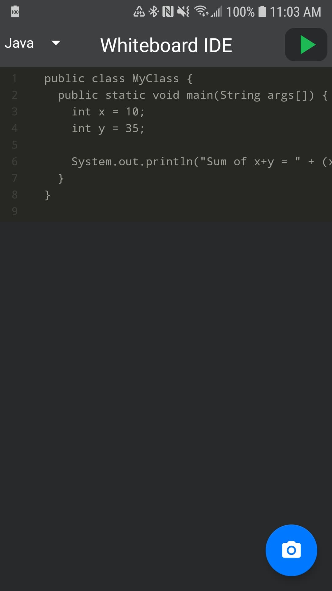
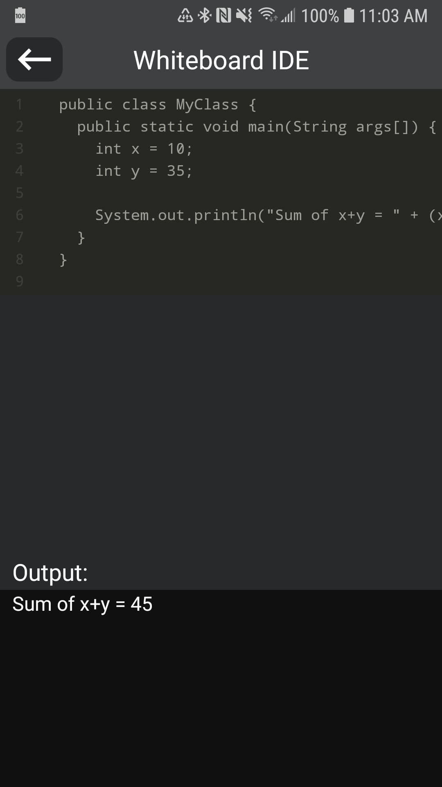
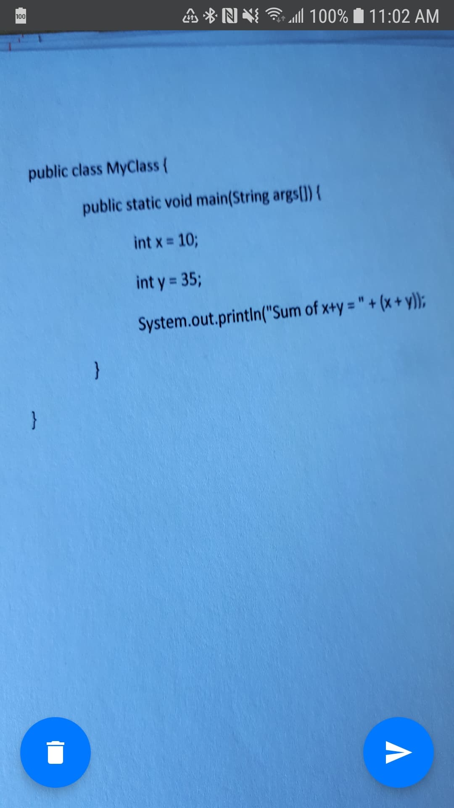

# whiteboard-ide

This repo contains the source code for an Android app built to make the life of a technical interviewer easier.  It was built with Java, and the Azure Computer Vision API from Microsoft.  
# Introduction 
Interviewing candidates for Software Engineer positions has largely stayed the same for a number of years.  The most widely used strategy for testing coding knowledge is the whiteboard interview.  Most questions asked in whiteboard interviews are difficult in nature, but don't require hundreds of lines of code to solve.  This app was created to allow the interviewer to immediately see the output of these smaller chunks of code instead of needing to run through it manually or typing it into an IDE.  
# Purpose
 - Allow interviewers to take a picture of a chunk of code, and immediately translate it into text on their phone
 - Provide editing functionality in case the code is not read properly from the photo
 - Run the code and display the output on the phone
# Challenges
 - Designing the UI, as UI design is not one of my strengths
# What's Next
At the moment, the app supports Java and C++ code.  I want to expand this further to include other languages in the future.  
As well, I would like to try to port this app idea to iOS eventually.  
# Screenshots
   
